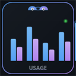

# Copilot Usage Dashboard

<p align="center">
  
</p>

<p align="center">
  <strong>A self-contained VS Code extension that gives you full visibility into your GitHub Copilot token usage.</strong>
</p>

<p align="center">
  
  
  
</p>

---

## What It Does

Copilot Usage Dashboard scans your local VS Code `chatSessions` files and (optionally) captures live OpenTelemetry data from Copilot to build a rich, interactive dashboard — all without any external database or server.

### Key Features

| Feature | Description |
|---------|-------------|
| **📊 Token Analytics** | Prompt, output, and cached token counts per session, model, project, and day |
| **🔍 Session Explorer** | Browse all Copilot chat sessions with title, preview, duration, tools, and subagent usage |
| **📁 Clickable File Links** | Open session log and transcript JSONL files directly from the dashboard |
| **🤖 Model Breakdown** | See usage split across Claude Opus, Sonnet, Haiku, GPT-4o, GPT-5, Gemini, etc. |
| **📈 Daily Trends** | Stacked bar chart showing daily prompt vs output token consumption |
| **🔧 Tool Usage** | Top tool calls ranked across all sessions |
| **🧑‍💻 Subagent Tracking** | Track `runSubagent` invocations by agent name |
| **⚡ Live OTel** | Real-time token visibility via built-in OTLP HTTP receiver (port 14318) |
| **🏷️ Premium Estimates** | Multiplier-based premium usage estimation per model |
| **🔄 Configurable Refresh** | Dashboard auto-refresh from 30s to 5m, or manual refresh on demand |
| **📌 Status Bar** | Always-visible session count and token totals in the VS Code status bar |
| **🗂️ Multi-Root Workspace** | Resolves `.code-workspace` files to show correct project names |

---

## Quick Start

### Install from VSIX

```
code --install-extension copilot-usage-dashboard-0.1.2.vsix
```

### Or Build from Source

```bash
cd copilot-usage-extension
npm install
npm run compile
npx @vscode/vsce package --allow-missing-repository
code --install-extension copilot-usage-dashboard-*.vsix
```

### Open the Dashboard

- **Command Palette** → `Copilot Usage: Open Dashboard`
- **Click the status bar** item showing session count / token totals

---

## Dashboard Overview

The dashboard opens as a VS Code webview tab with a dark GitHub-themed UI.

### Filter Bar

- **Model Checkboxes** — Filter by specific models (Claude Opus 4.6, GPT-5.4, etc.)
- **Time Range** — `7d` / `30d` / `90d` / `All`
- **Refresh Rate** — `30s` / `1m` / `2m` (default) / `5m` / `Off`
- **Manual Refresh** — ↻ button for on-demand refresh

### Stats Grid

Top-level cards showing: Sessions, Turns, Prompt Tokens, Output Tokens, Tool Calls, Subagent Calls, Est. Premium, Mirrors, and Transcripts.

### Charts

- **By Model** — Doughnut chart of token share per model family
- **Top Projects** — Horizontal bar chart of prompt + output tokens per workspace
- **Top Tools** — Horizontal bar chart of most-called tools
- **Daily Token Usage** — Stacked bar chart of daily prompt vs output tokens

### Sessions Table

Scrollable table with columns: Session ID, Project, Summary (title + preview + agent/account badges), Last Active, Duration, Model (with multiplier badge), Turns, Prompt, Output, Tools, Subagents, and **Files** (clickable log/transcript links).

### Live OpenTelemetry

When the OTel receiver is active, a dedicated section shows real-time request counts, prompt/output/cached tokens per model with both trace and metric sources.

---

## How It Works

### Data Sources

1. **chatSessions JSONL** — VS Code stores Copilot chat history at:
   ```
   %APPDATA%/Code/User/workspaceStorage/{hash}/chatSessions/*.jsonl
   ```
   The extension scans these files to extract sessions, turns, tool calls, and subagent invocations.

2. **Transcripts** — Located at:
   ```
   %APPDATA%/Code/User/workspaceStorage/{hash}/GitHub.copilot-chat/transcripts/
   ```

3. **Live OTel** (optional) — Copilot can export OpenTelemetry data. The extension runs an OTLP HTTP receiver on port `14318` and auto-configures the `github.copilot.chat.otel` settings.

### JSONL Format Support

The scanner handles both legacy and current JSONL formats:
- **Legacy (kind=1)**: Separate result entries with `k=["requests",N,"result"]`
- **Current (kind=0)**: Embedded `v.requests[]` arrays with full turn data

### Project Name Resolution

- Reads `.code-workspace` files from `workspaceStorage` to resolve multi-root workspace names
- Falls back to folder names or `multi-root-{hash}` for deleted workspaces

---

## Configuration

The extension auto-configures OTel settings on first activation:

| Setting | Value |
|---------|-------|
| `github.copilot.chat.otel.enabled` | `true` |
| `github.copilot.chat.otel.exporterType` | `otlp-http` |
| `github.copilot.chat.otel.otlpEndpoint` | `http://127.0.0.1:14318` |

> **Note:** A VS Code reload is needed after first install for Copilot to start exporting telemetry.

---

## Commands

| Command | Description |
|---------|-------------|
| `Copilot Usage: Open Dashboard` | Open or focus the dashboard webview |
| `Copilot Usage: Refresh Stats` | Force rescan of chatSession files and refresh dashboard |

---

## Architecture

```
copilot-usage-extension/
├── src/
│   ├── extension.ts        # Activation, command registration, timers
│   ├── scanner.ts          # JSONL parser for chatSessions & transcripts
│   ├── dashboardData.ts    # Aggregation: sessions → DashboardData
│   ├── dashboardPanel.ts   # Webview HTML with Chart.js visualizations
│   ├── otelReceiver.ts     # OTLP HTTP receiver (traces/metrics/logs)
│   └── statusBar.ts        # Status bar provider
├── images/
│   └── icon.svg            # Extension icon
├── package.json
├── tsconfig.json
└── README.md
```

---

## Requirements

- **VS Code** 1.85 or newer
- **GitHub Copilot Chat** extension (for chatSession data)
- No external database, server, or Python runtime needed

---

## Privacy

All data stays local. The extension only reads files from your VS Code `workspaceStorage` directory and listens on `127.0.0.1` for OTel data. No data is sent externally.

---

## License

[MIT](LICENSE)


